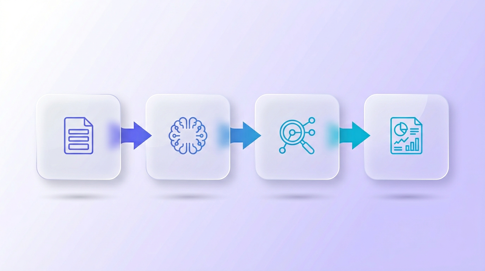
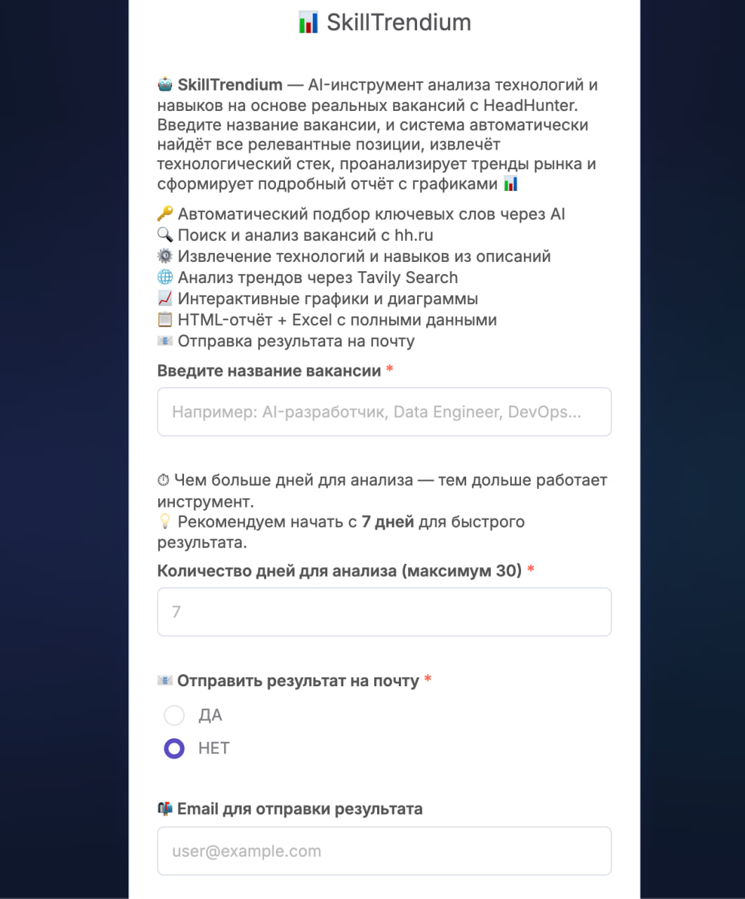
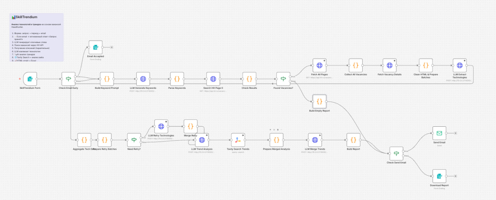
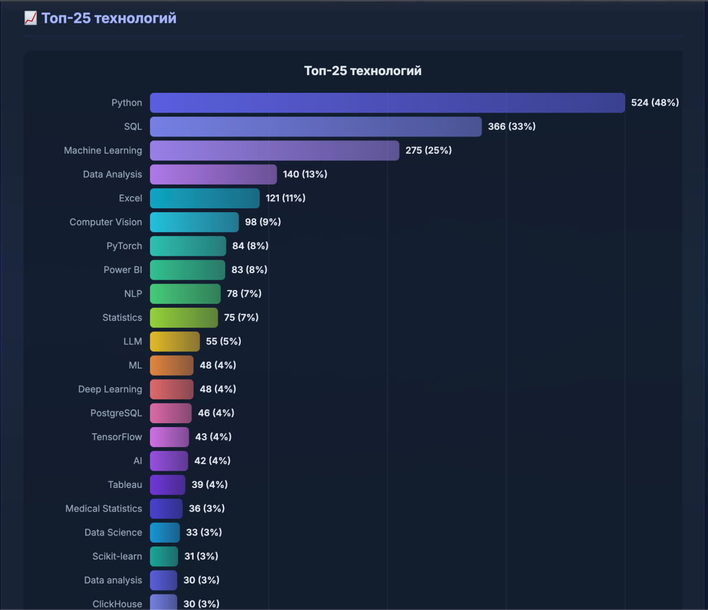
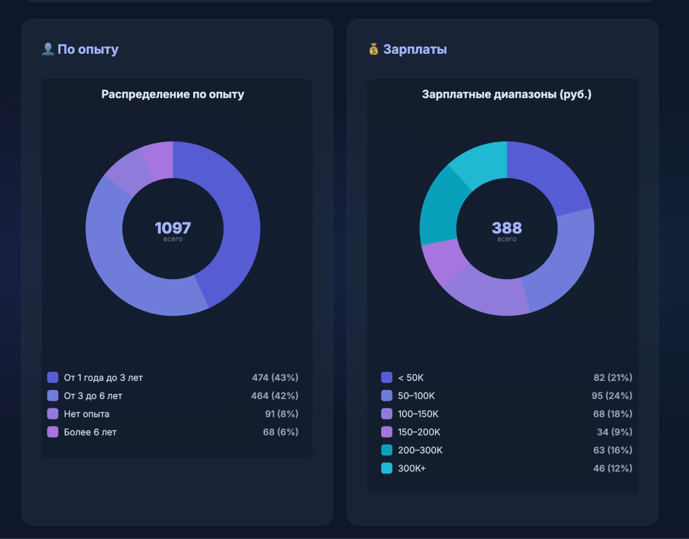
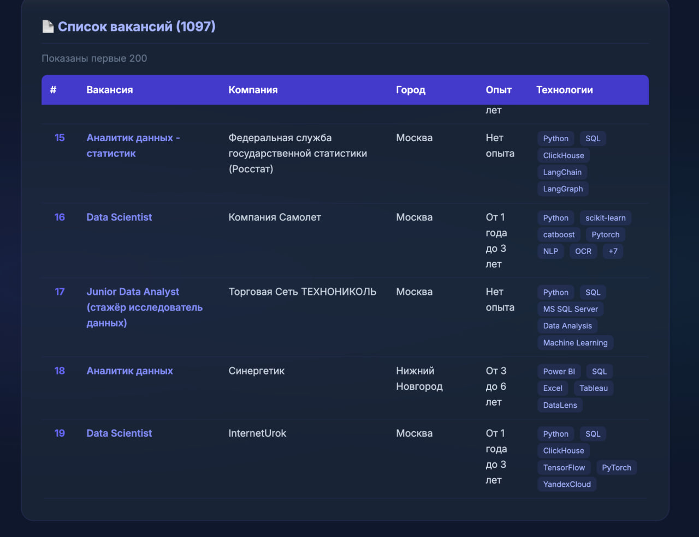
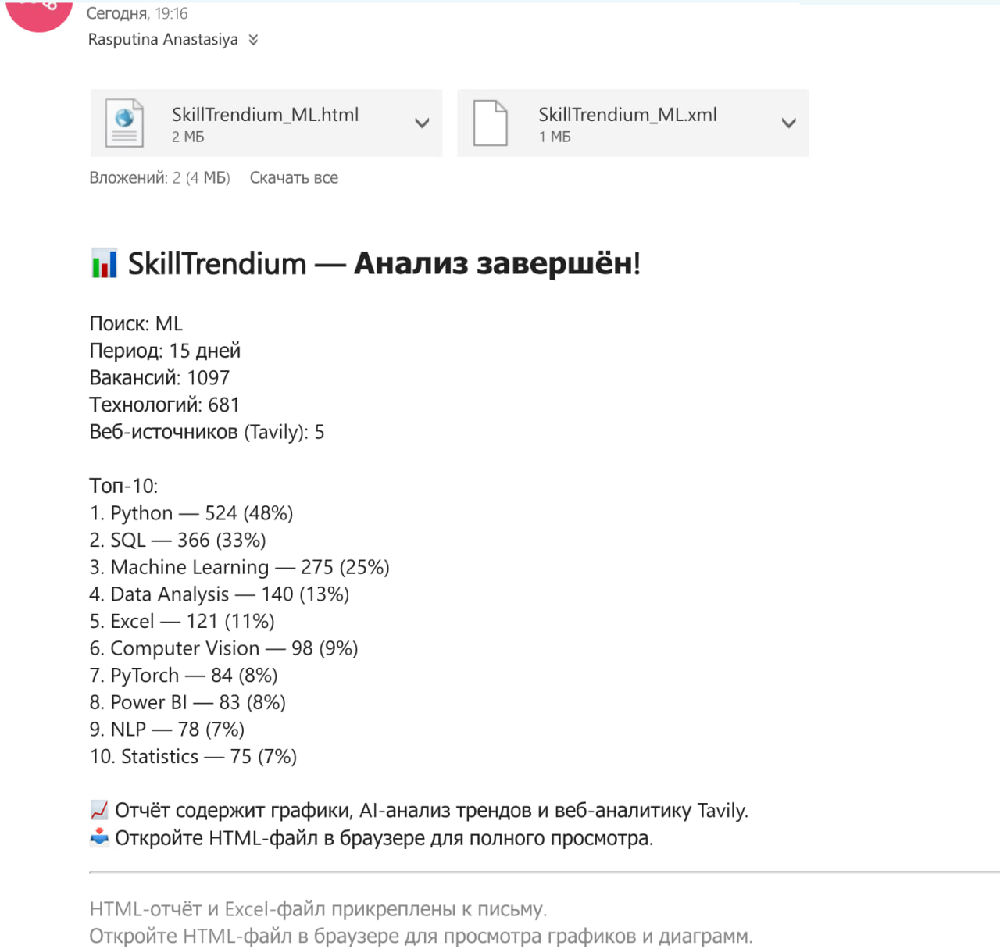

<!-- _class: title -->

# SkillTrendium

**AI-помощник для анализа трендов навыков на рынке труда**

*Вакансии HeadHunter + Tavily + LLM = аналитический отчёт за минуты*


---

## О проекте

**Тип:** Инструмент аналитики рынка труда

**Статус:** MVP

> **Что делает:** Собирает вакансии с HH, извлекает навыки через LLM, ищет тренды через Tavily, генерирует HTML-отчёт с графиками и отправляет на почту.

**Для кого:**
- **Соискатели** -- понять, что учить для смены направления
- **HR-команды** -- анализ рынка за минуты вместо часов
- **Образовательные платформы** -- актуализация программ
- **Карьерные консультанты** -- данные для рекомендаций

---

## Команда

| Имя | Роль |
|-----|------|
| Распутина Анастасия | Разработка, архитектура, ML |

**Репозиторий:** GitHub -- SkillTrendium

---

<!-- _class: problem -->

## Проблема: соискатель

**Что происходит сейчас:**
- **4-6 часов** на ручной анализ рынка при смене направления
- Повторяется **1-2 раза в месяц** в активном поиске
- Нерелевантные вакансии --> неэффективное обучение --> редкие офферы

**Стоимость ручного анализа:**
**4 000 -- 12 000 rub** на одного пользователя в месяц

> **С SkillTrendium:** Сокращение до **20-30 минут** --> экономия значимой части времени и денег

---

<!-- _class: problem -->

## Проблема: B2B

**HR-команды, рекрутинговые агентства, образовательные платформы:**

- **50-200 вакансий** анализируются для одного обзора рынка
- **6-12 часов** работы аналитика на один отчёт
- Задача возникает **2-4 раза в месяц**

**Стоимость ручной аналитики:**
**18 000 -- 144 000 rub** в месяц на одну команду

> **Результат без автоматизации:** Решения на основе неполных или устаревших данных

---

<!-- _class: solution -->

## Решение



**SkillTrendium** -- полный цикл аналитики:

1. Пользователь вводит вакансию и период
2. LLM генерирует ключевые слова
3. HH API собирает вакансии
4. LLM извлекает технологии (батчами)
5. LLM анализирует тренды
6. **Tavily** ищет веб-тренды
7. LLM формирует сводный анализ
8. HTML-отчёт с графиками
9. **Отправка отчёта на e-mail**

---

<!-- _class: tech -->

## Технический подход

| Компонент | Технология |
|-----------|-----------|
| Оркестрация | **n8n** -- low-code автоматизация |
| LLM | **Gemma 3 27B IT** -- открытая модель Google |
| Инференс | **vLLM** -- высокопроизводительный сервер |
| Вакансии | **HH API** -- открытый API HeadHunter |
| Веб-тренды | **Tavily** -- AI-поисковый API |
| Доставка | **E-mail** -- отправка отчёта на почту |
| Обработка | **Батчи по N** -- оптимизация LLM-вызовов |
| Отчёт | **HTML + SVG-графики** + Excel XML |

---

<!-- _class: tech -->

## Схема: ключевые технологии

```
┌─────────────────────────────────────────────────────────────────┐
│                        ПОЛЬЗОВАТЕЛЬ                             │
│                    (форма ввода запроса)                         │
└──────────────────────────┬──────────────────────────────────────┘
                           │
                           ▼
┌─────────────────────────────────────────────────────────────────┐
│                     n8n  ·  Оркестрация                         │
│  ┌──────────┐   ┌──────────────┐   ┌─────────────────────────┐  │
│  │  HH API  │──▶│  Gemma 3 27B │──▶│  Tavily Search API      │  │
│  │ вакансии │   │   (vLLM)     │   │  веб-тренды             │  │
│  └──────────┘   │  извлечение  │   └─────────────────────────┘  │
│                 │  технологий  │                                 │
│                 │  + анализ    │                                 │
│                 └──────────────┘                                 │
└──────────────────────────┬──────────────────────────────────────┘
                           │
                           ▼
┌─────────────────────────────────────────────────────────────────┐
│              HTML-отчёт (SVG-графики) + Excel XML               │
│                  скачивание / e-mail                             │
└─────────────────────────────────────────────────────────────────┘
```

---

<!-- _class: tech -->

## Пользовательский сценарий

```
Пользователь                           Система
     |                                    |
     |  "Data Engineer", 14 дней          |
     |----------------------------------->|
     |                                    |  LLM --> 20 ключевых слов
     |                                    |  HH API --> 250 вакансий
     |                                    |  LLM --> технологии (25 батчей)
     |                                    |  LLM --> анализ трендов
     |                                    |  Tavily --> веб-тренды
     |                                    |  LLM --> сводный анализ
     |                                    |  SVG-графики + HTML-отчёт
     |        Скачать + письмо на почту   |
     |<-----------------------------------|
```

---

<!-- _class: money -->

## Финансовая оценка

### Для соискателя

| Параметр | Ручной анализ | С SkillTrendium |
|----------|:---:|:---:|
| Время | 4-6 часов | 20-30 минут |
| Стоимость/мес | 4 000 -- 12 000 rub | ~0 rub |

### Для B2B (одна HR-команда)

| Параметр | Ручной анализ | С SkillTrendium |
|----------|:---:|:---:|
| Время на отчёт | 6-12 часов | ~30 минут |
| Стоимость/мес | 18 000 -- 144 000 rub | Инфраструктура |
| **Экономия/мес** | | **50 000 -- 80 000 rub** |

---

<!-- _class: money -->

## Стоимость и окупаемость

| Раздел | Сумма |
|--------|-------|
| Разработка (разово) | ~0 rub (open-source стек) |
| Cloud GPU A100 40/80GB (в месяц) | 100 000 -- 150 000 rub |
| n8n хостинг (в месяц) | 0 rub (self-hosted) |
| Tavily API (в месяц) | 0 rub (1 000 запросов бесплатно) |
| Поддержка (в месяц) | Минимальная |

> GPU-инфраструктура тиражируется на другие AI-решения компании -- затраты на каждый проект **существенно ниже**.

### ROI (на примере одной HR-команды)

- **Экономия:** 50 000 -- 80 000 rub/мес (замена ручного анализа)
- **Затраты GPU (доля проекта при 5 решениях):** ~25 000 rub/мес
- **ROI = (экономия - затраты) / затраты = 100--220%**
- **Срок окупаемости:** 1--2 месяца

**Альтернатива:** Проприетарные LLM (GPT, Perplexity) -- без GPU, оплата за токены

---

## Безопасность и ограничения

**Конфиденциальность:**
Анализируются только открытые данные -- публичные вакансии с hh.ru. Персональные данные не обрабатываются.

**Основные риски:**

| Риск | Митигация |
|------|-----------|
| Изменение HH API | Мониторинг, адаптация запросов |
| LLM галлюцинации | Structured JSON output, валидация |
| Rate-limit HH API (30 req/s) | Последовательная обработка, лимит 300 |

> **LLM:** Локальная (Gemma, Qwen на vLLM) или проприетарная (GPT) -- конфиденциальная информация отсутствует

---

<!-- _class: solution -->

## Текущий статус и демо

**Что готово:**
- n8n пайплайн -- полный цикл из **9 этапов** (включая e-mail)
- Форма ввода с кастомным дизайном
- Интеграция с HH API, LLM, Tavily и e-mail
- HTML-отчёт с SVG-графиками и AI-аналитикой
- **Автоматическая отправка отчёта на почту**

**Демо:**
- Работа пайплайна в n8n
- Пример отчёта по реальному запросу
- Форма ввода и отправка на почту

---

<!-- _class: screenshot -->

<div class="badge">Форма ввода</div>



---

<!-- _class: screenshot -->

<div class="badge">Пайплайн n8n</div>



---

<!-- _class: screenshot -->

<div class="badge">Отчёт: графики технологий</div>



---

<!-- _class: screenshot -->

<div class="badge">Отчёт: аналитика и тренды</div>



---

<!-- _class: screenshot -->

<div class="badge">Отчёт: детальная статистика</div>



---

<!-- _class: screenshot -->

<div class="badge">Отправка на e-mail</div>



---

<!-- _class: title -->

# Спасибо!

**SkillTrendium** -- данные вместо догадок

*Вопросы?*


